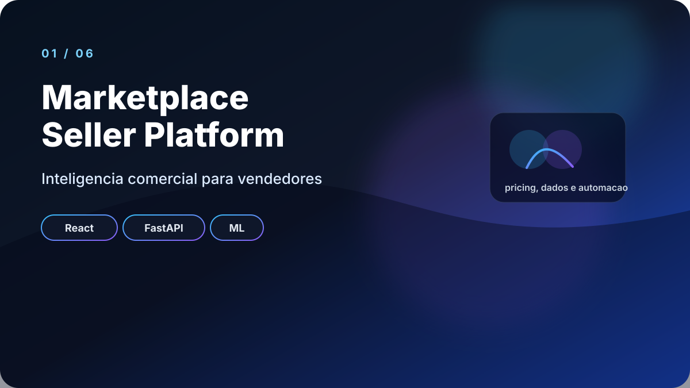
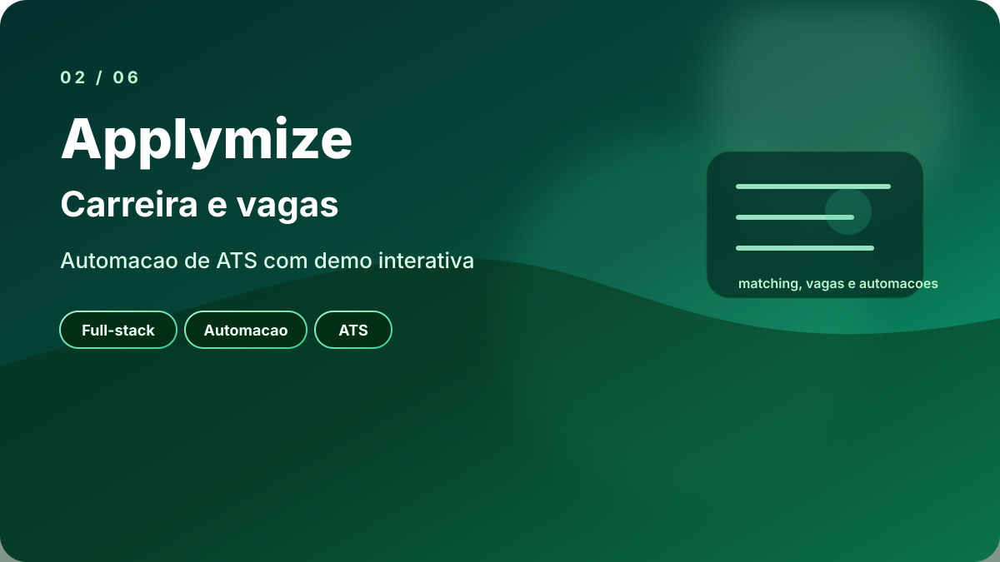
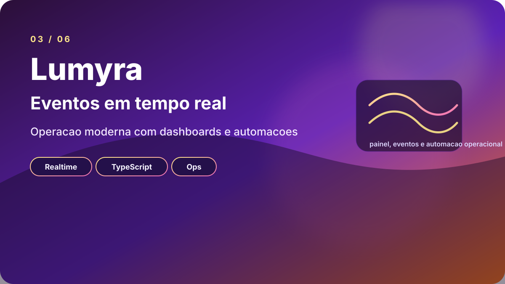
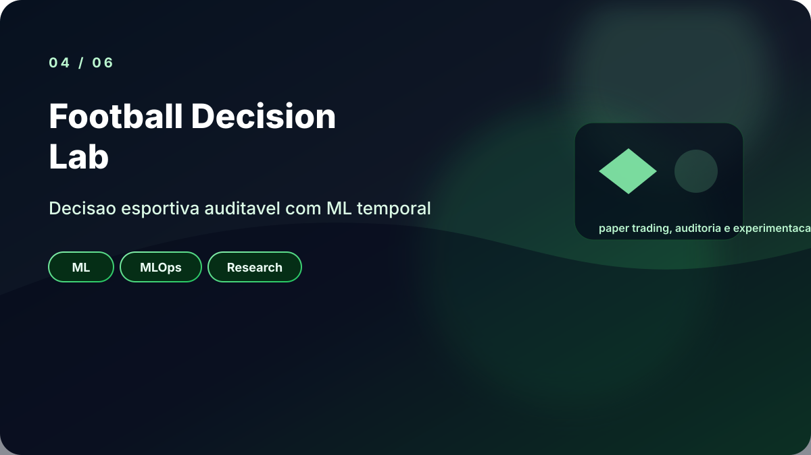
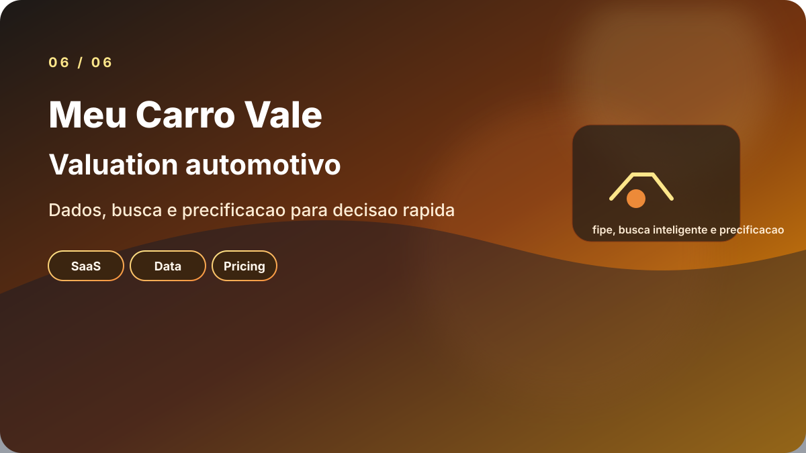

<strong>Produtos digitais com dados, automacao e IA.</strong>

## Sobre mim

Construo produtos que saem do conceito e entram em operacao.

- Full-stack com Python, FastAPI, React e SQL
- Automacao de processos, integrações e pipelines
- IA aplicada a decisao, pricing e operação
- Produtos SaaS com foco em clareza, utilidade e acabamento

## Projetos em destaque

<table>
  <tr>
    <td width="50%" valign="top">
      
       
      <strong><a href="https://github.com/vinmedrado/marketplace-seller-platform">Marketplace Seller Platform</a></strong> 
      Inteligencia comercial para vendedores, com precificacao, dados e ML.
    </td>
    <td width="50%" valign="top">
      
       
      <strong><a href="https://github.com/vinmedrado/applymize">Applymize</a></strong> 
      Carreira, vagas e automacao de ATS em uma experiencia interativa.
    </td>
  </tr>
  <tr>
    <td width="50%" valign="top">
      
       
      <strong><a href="https://github.com/vinmedrado/Lumyra">Lumyra</a></strong> 
      Operacao moderna de eventos com realtime, paineis e automacoes.
    </td>
    <td width="50%" valign="top">
      
       
      <strong><a href="https://github.com/vinmedrado/football-decision-lab">Football Decision Lab</a></strong> 
      Sistema auditavel de decisao esportiva com ML temporal e MLOps.
    </td>
  </tr>
  <tr>
    <td width="50%" valign="top">
      
       
      <strong><a href="https://github.com/vinmedrado/vinance">Vinance</a></strong> 
      Copiloto financeiro com IA para orcamento, ERP e investimentos.
    </td>
    <td width="50%" valign="top">
      
       
      <strong><a href="https://github.com/vinmedrado/meu-carro-vale">Meu Carro Vale</a></strong> 
      Valuation automotivo com dados, busca inteligente e precificacao.
    </td>
  </tr>
</table>

## Stack

  

## GitHub

  
  

_Ideias viram produto quando visual, dados e execucao trabalham juntos._

