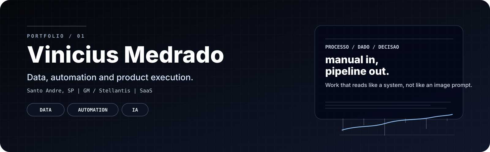
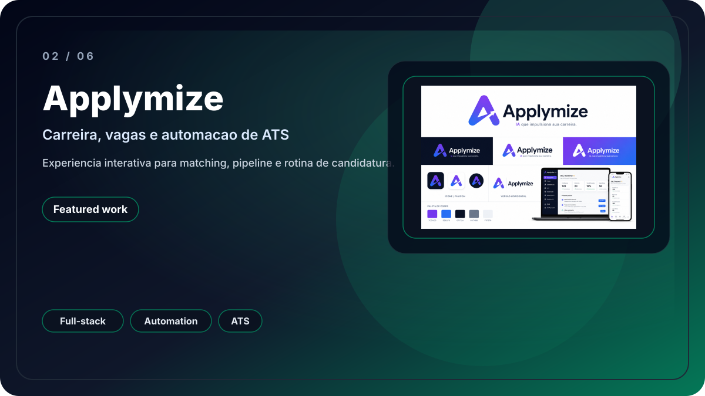
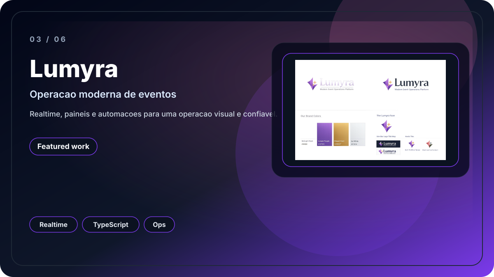
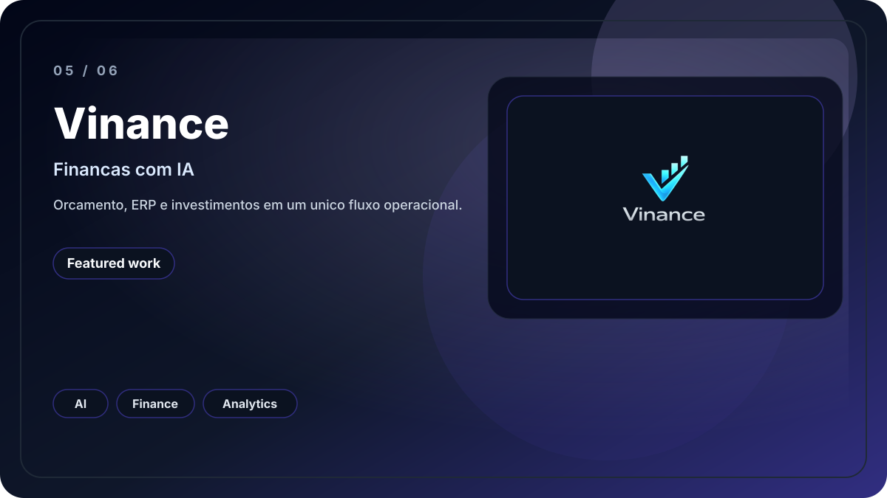
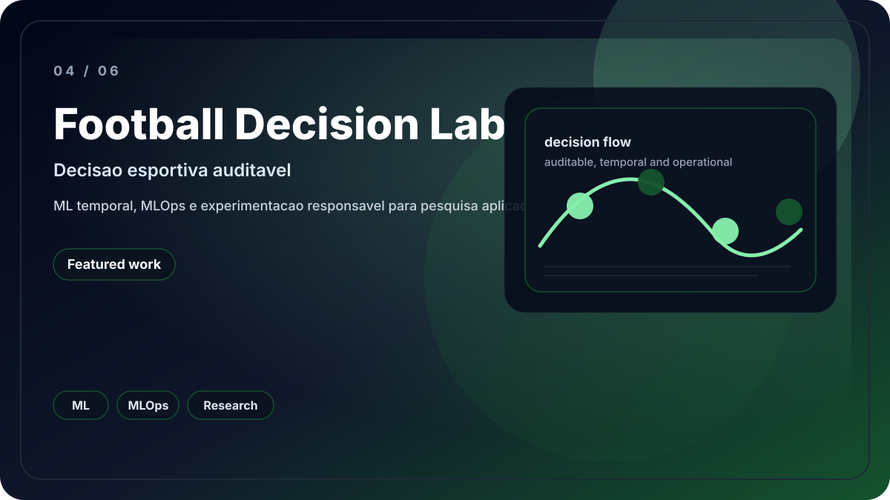

<strong>Data, automacao e IA aplicadas a produtos digitais.</strong>

## Perfil

Sou engenheiro de software focado em produtos de dados, automacao e SaaS. Trabalho entre backend, dados e interface para transformar processos manuais em sistemas claros, confiaveis e escalaveis.

- Python, FastAPI, React, TypeScript e SQL
- Produtos SaaS, dashboards e fluxos operacionais
- Integracoes com APIs, ETL e automacoes
- Machine Learning e IA aplicados a decisao, priorizacao e analise

## Atualmente

- PL Data Analyst
- MSX International
- Projeto Stellantis

## O que aparece nos projetos

- Desenho sistemas que unem operacao, dados e produto.
- Mantenho foco em clareza visual, estrutura e manutencao.
- Traduzo problemas reais em fluxos executaveis.
- Escrevo codigo e documentacao para uso real, nao para efeito visual.

## Metricas verificadas

- Projetos publicados: 6
- Tecnologias dominadas: 8
- Demais metricas de produto, automacao, APIs, dashboards, ML e IA: TODO

## Trabalhos selecionados

<table>
  <tr>
    <td width="50%" valign="top">
      
       
      <strong>Marketplace Seller Platform</strong> 
      Inteligencia comercial para vendedores, com precificacao, dados e ML.
    </td>
    <td width="50%" valign="top">
      
       
      <strong>Applymize</strong> 
      Carreira, vagas e automacao de ATS em uma experiencia interativa.
    </td>
  </tr>
  <tr>
    <td width="50%" valign="top">
      
       
      <strong>Lumyra</strong> 
      Operacao moderna de eventos com realtime, paineis e automacoes.
    </td>
    <td width="50%" valign="top">
      
       
      <strong>Vinance</strong> 
      Sistema financeiro com IA para orcamento, ERP e investimentos.
    </td>
  </tr>
</table>

## Outros trabalhos

<table>
  <tr>
    <td width="50%" valign="top">
      
    </td>
    <td width="50%" valign="top">
      
    </td>
  </tr>
</table>

## Demonstracoes de produto

<table>
  <tr>
    <td width="50%" valign="top">
      
    </td>
    <td width="50%" valign="top">
      
    </td>
  </tr>
</table>

## Capacidade tecnica

  

## SEO / Keywords

Python | FastAPI | React | TypeScript | Power BI | Data Engineering | Automation | Machine Learning | Artificial Intelligence | SQL | PostgreSQL | Docker

## Contato

  <a href="https://www.linkedin.com/in/viniciusmedrado">LinkedIn</a> |
  <a href="mailto:medrado.jobs@gmail.com">E-mail</a> |
  <a href="https://github.com/vinmedrado?tab=repositories">Repositorios</a>

  <picture>
    <source media="(prefers-color-scheme: dark)" srcset="https://raw.githubusercontent.com/vinmedrado/vinmedrado/output/github-contribution-grid-snake-dark.svg">
    
  </picture>

